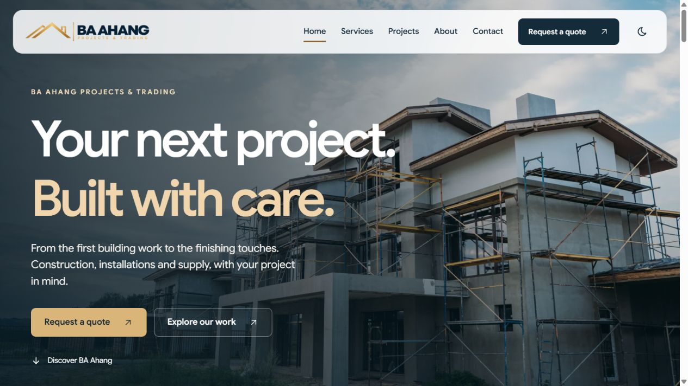
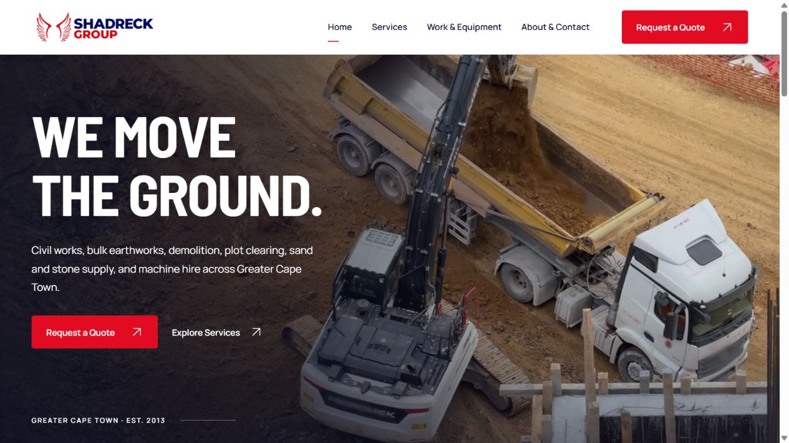
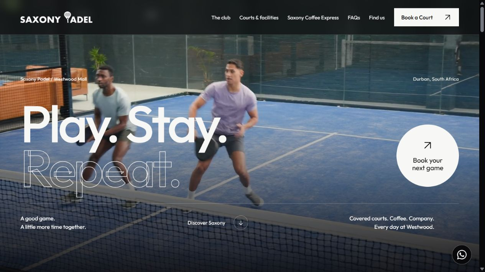
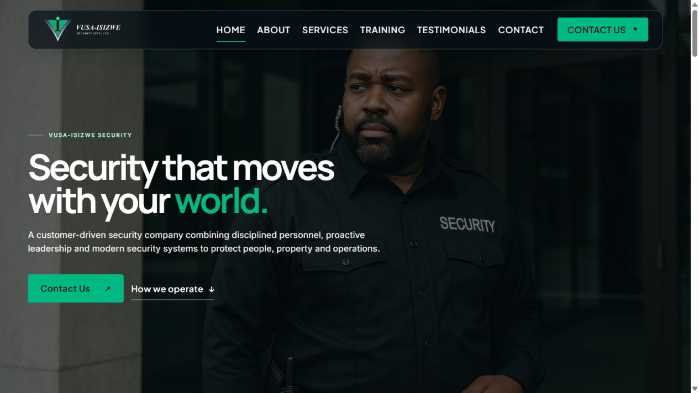
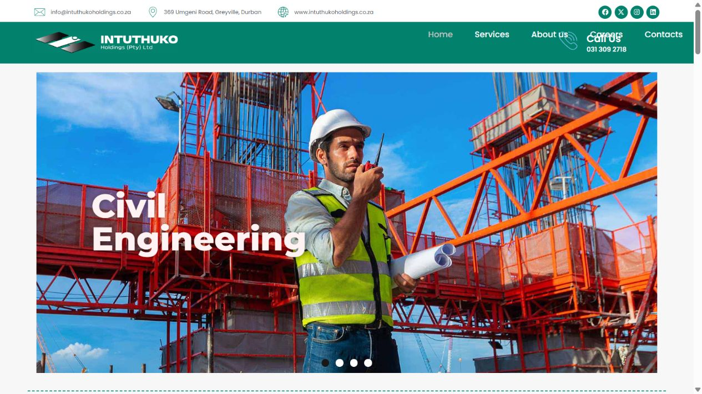
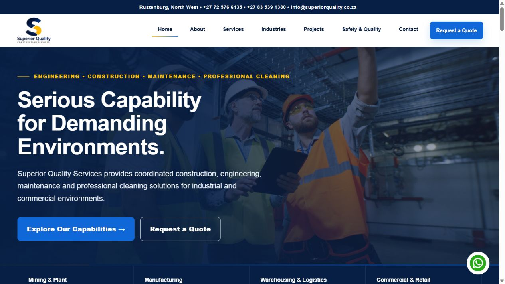
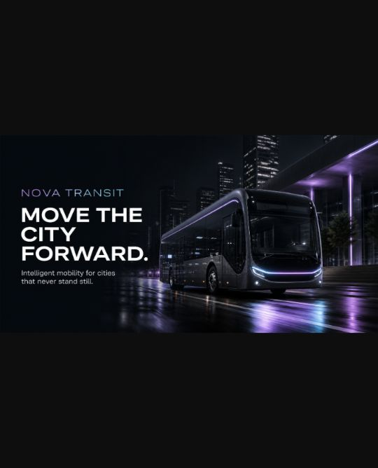

# John Buhendwa

### Web Development · UI/UX Design · Digital Experiences

Durban, South Africa. Web Developer / Graphic Designer at **DC Administration (Pty) Ltd — Dotcom African** and founder of **CJ Web Studio**.

I combine web development and visual design to create clear, responsive digital experiences. My work spans corporate websites, construction and service businesses, sports experiences and experimental 3D interfaces.

[LinkedIn](https://www.linkedin.com/in/john-buhendwa-0ba4833a3/) · [Explore the portfolio below](#project-portfolio)

**Tools:** React · Next.js · TypeScript · JavaScript · HTML/CSS · WordPress · Elementor · GSAP · Motion · Three.js / React Three Fiber · Python / Django

## Project portfolio

Eight projects, presented through previews, screenshots and concise project notes. Live links below are public viewing destinations; some are previews or concepts rather than final production launches. Private project source is not included in this profile repository.

| Project | Focus | View |
| --- | --- | --- |
| BA Ahang Projects & Trading | Next.js / React business website | [Preview](https://mrbrand.co.za/websites/ba-ahang/) |
| Shadreck Group | React, responsive layouts and motion | [Preview](https://mrbrand.co.za/websites/shadreck/Website/) |
| Saxony Padel Westwood | Sports-club concept and cinematic UI | [Concept preview](https://saxony-padel-westwood.vercel.app/) |
| Vusa-Isizwe Security | WordPress / Elementor redesign | [Redesign preview](https://dotcom.africa/websites/vusaisizwe/vusa-redesign/) |
| Intuthuko Holdings | Corporate WordPress / Elementor design | [Website](https://dotcom.africa/websites/ntuthukoholdings/) |
| Superior Quality Services | Corporate WordPress / Elementor website | [Website](https://dotcom.africa/websites/superiorqualityservices/) |
| NOVA Transit | Fictional 3D mobility concept | [Concept visual](#nova-transit) |
| Green Reeds Projects | PHP website with React enhancements | [Project notes](#green-reeds-projects) |

### BA Ahang Projects & Trading

A business website presenting construction, finishing, installations and supply. Built with Next.js, React, TypeScript, Tailwind and Motion, with responsive service sections and a photographic work gallery. The static export supports conventional web hosting. Enquiries prepare an email draft rather than claiming direct delivery.

[Explore the website preview →](https://mrbrand.co.za/websites/ba-ahang/)

### Shadreck Group

A four-page construction and earthworks website using React, Vite, GSAP and Motion. Features include scroll-driven typography, an animated service selector, a work gallery and reduced-motion support. Presented as a preview while final launch details are resolved.

[Explore the website preview →](https://mrbrand.co.za/websites/shadreck/Website/)

### Saxony Padel Westwood

An eight-page sports-club concept with a cinematic visual direction, React / GSAP enhancements, touch-friendly galleries and a coffee experience. Court-booking links lead to the external Playtomic listing; the concept does not implement a booking or payment backend.

[Explore the concept preview →](https://saxony-padel-westwood.vercel.app/)

### Vusa-Isizwe Security

A WordPress / Elementor redesign exploring a dark security aesthetic, green brand accents, structured service navigation and responsive layouts. This is a redesign preview, separate from the existing live website.

[Explore the redesign preview →](https://dotcom.africa/websites/vusaisizwe/vusa-redesign/)

### Intuthuko Holdings

Corporate WordPress / Elementor website design presenting group services, operating companies and office information. The project combines industrial imagery, a green brand palette and reusable page elements.

[View the website →](https://dotcom.africa/websites/ntuthukoholdings/)

### Superior Quality Services

A WordPress / Elementor corporate website covering construction, engineering, maintenance and professional cleaning. The visual system uses navy, blue and gold with structured service pages, shared navigation and responsive layouts.

[View the website →](https://dotcom.africa/websites/superiorqualityservices/)

### NOVA Transit

A fictional future-mobility concept exploring a cinematic, scroll-driven 3D experience. React, Three.js / React Three Fiber, GSAP ScrollTrigger and Lenis coordinate vehicles, camera movement and six narrative chapters. The image above is the project's concept preview artwork, not a screenshot of a verified public deployment.

### Green Reeds Projects

A company website combining PHP page templates, service-detail routes and editable React enhancements. Work includes responsive layouts, image optimisation and a reusable content structure.

The previously saved preview address is unavailable at present. This entry preserves the project overview; a working public preview or website screenshot will be added when available.

## Background

- Certificate in Full Stack Development — FNB App Academy / IT Varsity, July 2025.
- Freelance web development and graphic design experience since 2023.
- Additional experience in CAD / architectural visualisation and operations management.

## Connect

[Find me on LinkedIn →](https://www.linkedin.com/in/john-buhendwa-0ba4833a3/)

Project brands, website content and third-party media remain the property of their respective owners. Portfolio previews demonstrate website and design work; they do not imply ownership of the featured businesses or their operational results.
